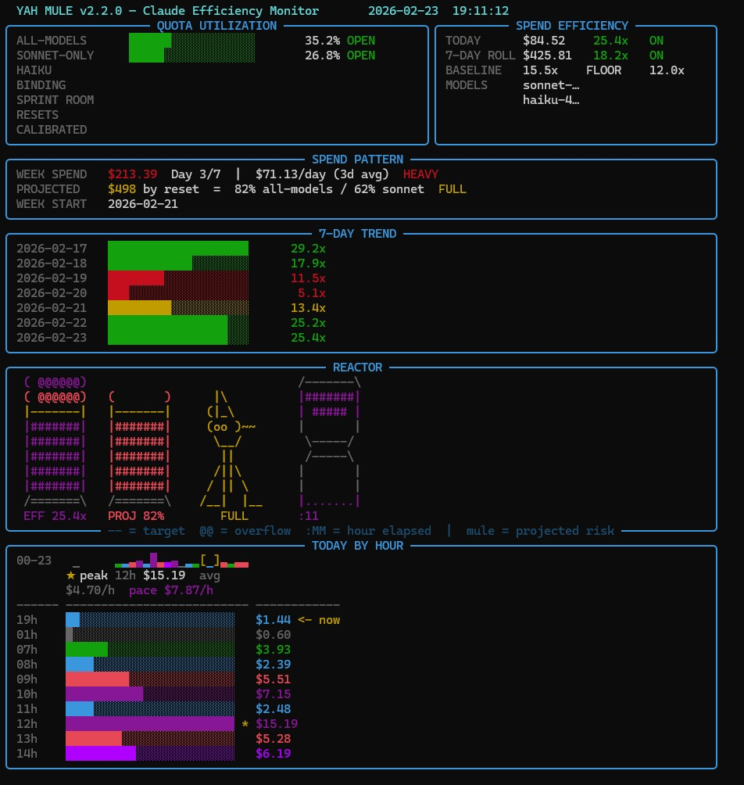

# YAH!!! Mule Agent Pacer


> *"Know your quota. Work the mules hard. Don't go over."*

A live terminal dashboard for Claude Max subscribers running heavy agentic workloads. Tracks weekly API spend, efficiency ratios, hourly burn patterns, and projected quota utilization — so you can drive the mules hard without blowing the reactor.

---

## Live Dashboard



The full-screen monitor updates every 60 seconds. Every panel tells a specific part of the story.

---

## Reading the Dashboard

### QUOTA UTILIZATION (top left)
Your dual spend limits. Claude Max tracks an all-models cap and a Sonnet-specific cap separately — the one closer to its ceiling is your **binding limit**. Green = open, yellow = approaching gate (80%), red = stop sprinting (90%).

### SPEND EFFICIENCY (top right)
The `x` number is your **value-per-dollar ratio** — how much plan-value you're extracting per dollar spent. `25x` means you're generating 25x the baseline daily plan value per dollar. `ON` / `BELOW` / `LOW` shows where you stand relative to your target baseline.

This is your quality-of-work signal. A low ratio means shallow sessions, throwaway runs, or idle context. A high ratio means focused, high-output work.

### SPEND PATTERN
Weekly pacing. `HEAVY` / `HIGH` / `NORMAL` shows spend rate vs your historical baseline. `PROJECTED` extrapolates your 3-day average to end-of-week — `FULL` means you'll land around 65–84% of quota (ideal), `GATE` means you'd breach the 80% sprint gate before reset.

### 7-DAY TREND
One bar per day, sized and colored by efficiency ratio. Green = on target, yellow = below baseline, red = well below floor. Lets you spot exploration days vs deep-work days at a glance.

### REACTOR

| Column | What it shows |
|---|---|
| **EFF stack** | Today's efficiency ratio vs your baseline. Smoke rings (@@) at the top = overflow — you're well above target |
| **PROJ stack** | Projected end-of-week quota %. The `──` marker = your sprint gate target |
| **Mule** | Color = projected quota risk. Green = GOOD (<65%), yellow = FULL (65–84%), red = GATE (85%+) |
| **Hourglass** | Current hour progress. Top sand (#) depletes, bottom sand (.) accumulates as minutes tick 0→59. Color = this hour's burn rate vs day average. Label shows `:MM` elapsed and projected `$/h` |

The REACTOR gives you one glance to answer: *"Am I working efficiently, am I pacing the week well, and how hot is this hour burning?"*

### TODAY BY HOUR
- **Sparkline** (top row): All 24 hours compressed into a single line using `▁▂▃▄▅▆▇█`. Current hour is in `[brackets]`.
- **Stats row**: Peak hour (★), average $/h across active hours, and current-hour projected pace.
- **Active hours list**: Current hour is always shown first (always visible regardless of terminal height). Past active hours follow in chronological order. Peak hour is marked ★. Pre-dawn hours (0–6h) are dimmed.

---

## Quick Start

```bash
# Install ccusage (requires Node.js)
npm install -g ccusage

# Clone this repo
git clone https://github.com/ghighcove/yah-mule-agent-pacer.git
cd yah-mule-agent-pacer

# Launch the live monitor (recommended)
python yah_mule.py

# Single-shot output and exit
python yah_mule.py --once

# Windows: persistent terminal window
open_monitor.bat

# Calibrate to your actual subscription limit (run once)
python yah_mule.py --calibrate 607
```

---

## Calibration — Set These Once

The dashboard needs four things calibrated to your reality before the numbers mean anything.

### 1. Weekly quota cap

```bash
python yah_mule.py --calibrate <your_weekly_usd_equiv>
```

Find your weekly cap: go to **claude.ai → Usage**, read your current week's ccusage-equivalent value, and pass it here. This writes `quota_config.json` which persists across sessions. Re-calibrate if your subscription tier changes.

### 2. Billing cycle anchor

In `kpi_display_v2.py`, find `get_week_start()` and update the anchor date to match your billing cycle:

```python
anchor = date(2026, 2, 7)  # ← change to your billing cycle start date
```

### 3. Reset hours (if yours differ)

```python
ALL_MODELS_RESET_HOUR = 12   # hour of day your all-models quota resets (0–23)
SONNET_RESET_HOUR     = 26   # 24 + hour if it resets next-day (e.g. 26 = 2am next day)
```

### 4. Efficiency baseline

```python
RATIO_BASELINE = 15.5   # your "good day" value-per-dollar target
RATIO_FLOOR    = 12.0   # warning threshold
```

Rule of thumb: pull your 30-day average efficiency ratio from ccusage, set `RATIO_BASELINE` to ~80% of that, and `RATIO_FLOOR` to ~60%. The default 15.5x was calibrated for heavy Sonnet-focused agentic work.

---

## Fine-Tuning

These constants in `kpi_display_v2.py` are the main levers:

| Constant | Default | What it controls |
|---|---|---|
| `QUOTA_SPRINT_GATE` | 0.80 | Stop new sprint work above this % of quota |
| `QUOTA_ABORT` | 0.90 | Hard stop threshold |
| `QUOTA_SCHED_RESERVE` | 0.05 | Buffer reserved for scheduled/cron jobs |
| `WEEKLY_SPEND_BASELINE` | $55 | Reference for spend% coloring (your historical avg) |
| `PLAN_DAILY_USD` | $100/30 | Daily value plan (used to compute efficiency ratio) |

---

## The Sprint Gate Logic

Used by automation patterns to prevent runaway quota burn:

```python
if quota_pct > 90:
    # STOP. Do not proceed.
    print(f"Quota at {quota_pct:.0f}%. Aborting.")
    sys.exit(1)
elif quota_pct > 80:
    # WARN. Ask before proceeding.
    print(f"Quota at {quota_pct:.0f}%. Proceed? (yes to continue)")
```

---

## Files

| File | Purpose |
|------|---------|
| `yah_mule.py` | Unified launcher — always use this |
| `kpi_display_v2.py` | Live display engine: rich.live full-screen layout, all panels |
| `kpi_display.py` | v1 display + calibration logic (`--calibrate` delegates here) |
| `usage_tracker.py` | Core tracking: daily/weekly aggregation, SQLite persistence |
| `quota_config.json` | Your calibrated quota settings (gitignored, created on first calibration) |
| `open_monitor.bat` | Windows: opens a persistent terminal running the monitor |
| `watch.ps1` | PowerShell fallback (v1 only) |
| `CHANGELOG.md` | Version history |
| `docs/screenshot.jpg` | Live dashboard screenshot |

---

## Requirements

- Python 3.8+
- [`rich`](https://github.com/Textualize/rich) — `pip install rich`
- [`ccusage`](https://github.com/ryoppippi/ccusage) CLI — `npm install -g ccusage`
- Claude Max subscription

---

## Why This Exists

My purpose here was to literally squeeze every cent I could out of my flat-fee agentic AI subscription. Claude Max charges a fixed monthly fee regardless of how much you use — so idle cycles and shallow sessions are wasted money. Future iterations will include other dashboards and innovations, as well as load-balancing measurement across model tiers.

Drive them mules, YAAAAHHH! Run that nuclear plant at 99%. Don't let the reactor idle — every wasted cycle is a cent you already paid for.

---

## Dashboard Integration

The `assets/promo/` directory contains images suitable for embedding in dashboards or README headers.

| File | Description |
|------|-------------|
| `yah-mule-38.jpg` | Clean hero shot — wide horizontal, no text |
| `yah-mule-39.jpg` | Clean hero shot — portrait, no text |
| `yah-mule-43.jpg` | YAH!!! — orange glow, portrait (README default) |

---

## Credits & Attribution

- **[ccusage](https://github.com/ryoppippi/ccusage)** by ryoppippi — the underlying CLI that tracks Claude Code token usage. Yah Mule reads ccusage output as its data source.
- Quota monitoring patterns and sprint gate concepts inspired by the Claude Code community on X and various open discussions around Claude Max subscription management.
- The KPI design, REACTOR panel, hourglass/sparkline display, sprint gate logic, SQLite persistence layer, terminal UI, and calibration system are original work.

If you recognize something here as yours and want a specific credit added, open an issue — happy to acknowledge it properly.

---

## License

MIT.

---

*YAH!!! — because sometimes the mules need to move.*
